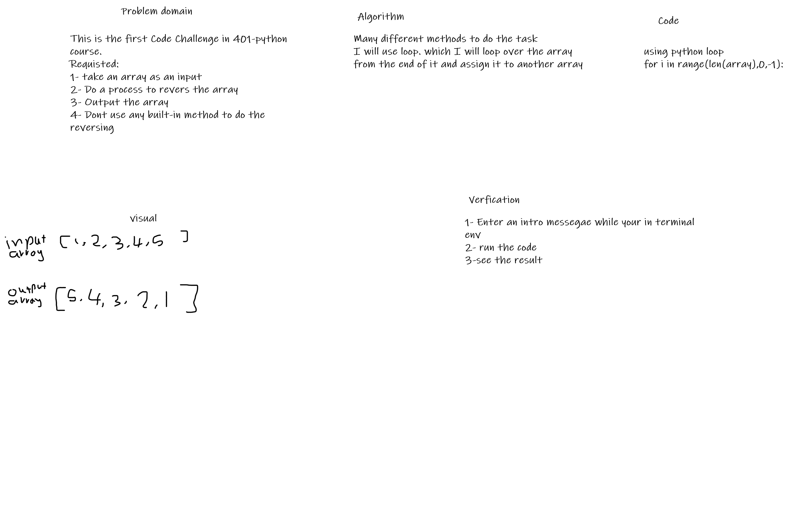
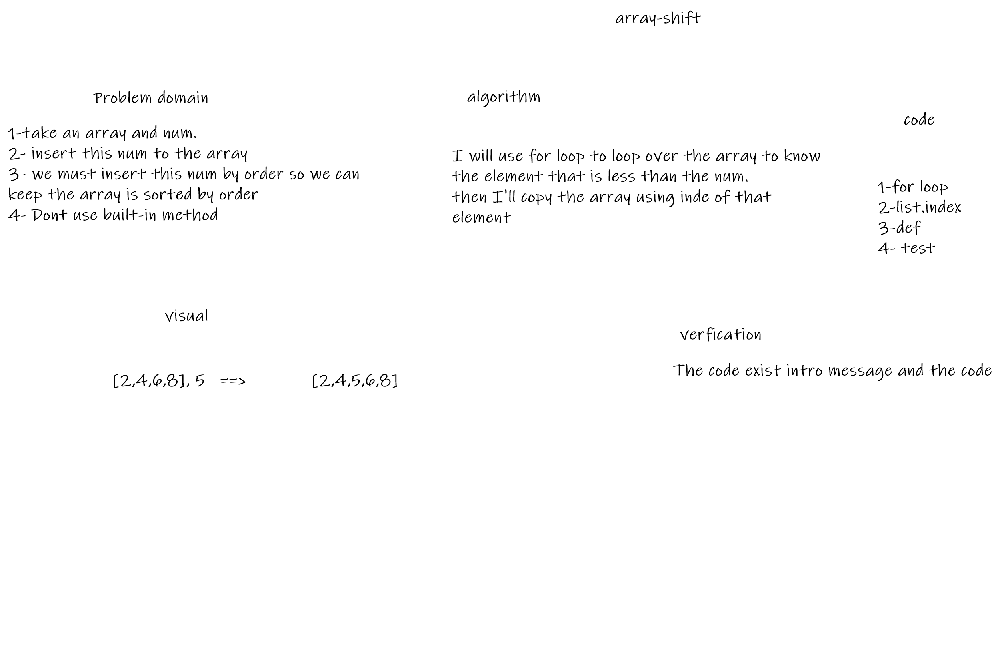

# 401 Python Data Structures and Algorithms

Should be copied and moved to course repo as a reference folder for student's code challenge submissions.

**NOTE:** may be replaced by cross course dsa repo

# Reverse an Array
<!-- Short summary or background information -->
take a certain array and process it to produce a new array with exact entries but in reversly.

## Challenge
<!-- Description of the challenge -->
We have been asked to not use any built-in method. So, we need to use oyr logic

## Approach & Efficiency
<!-- What approach did you take? Why? What is the Big O space/time for this approach? -->
it taked 30 min

## Solution
<!-- Embedded whiteboard image -->

# array-shift

# Challenge Summary
<!-- Short summary or background information -->
insert an element(number) to an array. With a condition that the array still ordered

## Challenge Description
<!-- Description of the challenge -->
given an ordered array with number. we want to insert this number by order to the array without using and built-in method

## Approach & Efficiency
<!-- What approach did you take? Why? What is the Big O space/time for this approach? -->
For loop was used with functions.
A test was established for this Code challenge

## Solution
<!-- Embedded whiteboard image -->

assets/array-shft.png
